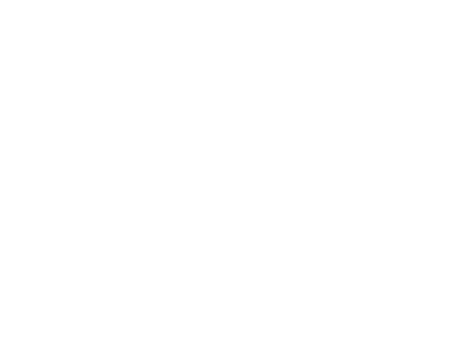
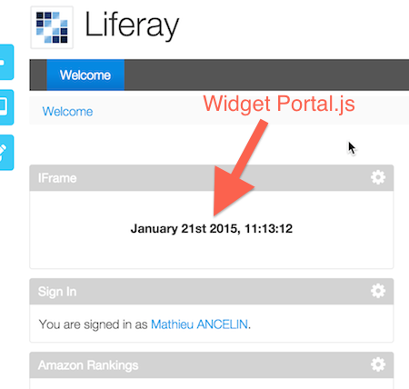

About Portal.js
==========================

This library aim at providing a widget mashup UI like netvibes, iGoogle or Java portals.
To use the lib, write something like :

```javascript

var portal = Portal.bootstrap({
    userId: '1234567890',
    adminMode: true,
    apiRootUrl: '/portal/services',
    container: 'myDivContainer'
});

```

This code will render the widget UI in the `#myDivContainer` div.



Examples
========

* <a href="./example/index.html">Portal example with using `localStorage` store</a>
* <a href="./example/single.html">Clock portlet in single mode (iframe mode)</a>

Configuration
==============

You can override some stuff when declaring your portal instance. Default values are :

```javascript
{
    userId                          // the tenant
    apiRootUrl                      // the root of REST services for REST store
    container: 'portal-container',  // container where portal will be rendered
    adminMode: false,               // render with admin mode (drag and drop, etc ...)
    bindTabToHash: false,           // use URL hash for tab navigation
    onTabLoad: function(tabs) {},   // callback when tabs are loaded from server API
    showTabAtStartup: 0,            // first tab shown after loading (int, obj, function)
    widgetsCatalog: Portal.ChooseWidgetPopup, // UI for widgets catalog
    store: { ... },                 // store that handle data loading and saving
    singleMode: false               // mode to display one widget in a portal
}
```

`showTabAtStartup` can be the index of the tab in the array of tabs, or a predicate object used by `_.findWhere`, or a predicate function used by `_.find`.

REST API
=========

The lib will fetch some data from server to show widget. The expected structure is :

```javascript
[{                                               // a tab
    "id": "8"
    "title": "Accueil",
    "position": 0,
    "rows": [{                                   // a row
        "id": "12"
        "title": "Row 3",
        "position": 2,
        "widgets": [{                            // a widget
            "id": "29"
            "name": "Evol. CA HT",
            "position": 0,
            "jsWidgetName": "ProgressionCA",
            "width": 8,
            "preferences": {                     // a preference
                "title": "Yeah"
            },
        }, {                                     // a widget
            "id": "28"
            "name": "Suivi de la substitution",
            "position": 1,
            "jsWidgetName": "Substitution",
            "width": 4,
            "preferences": {},
        }],
    }],
}]
```

When creating a portal instance you will use Portal.bootstrap(opts)

then the server API is supposed to be like :

```
GET      @root/api/@userId        : return array of tabs
POST     @root/api/@userId        : save array of tabs and return result tabs
```

you can override all URL when using `boostrap` function

```javascript
{
    tabsGetUrl: '@root/api/@userId',
    tabsSavetUrl: '@root/api/@userId'
}
```

if you don't provide an `apiRootUrl`, the portal instance will use a localStorage store to save user data.

Stores
======

<a href="store.html">Here is a page dedicated to portal stores</a>

Widgets catalog
=====================

<a href="catalog.html">Here is a page dedicated to widgets catalog</a>

Public API
==========

The only functions you can use are :

- `Portal.bootstrap(opts)` : bootstrap a portal interface in the current page
- `Portal.Widget(opts)` : create a Widget class
- `Portal.registerWidget(uniqueId, Widget)` : register a Widget class in the current widget namespace

Portal instance API
===================

The portal instance hold the following functions :

- `getTabs()` : return all tabs
- `navigateToTab({ id: id })` : render tab with id
- `removeTab({ id: id })` : delete tab with id
- `addTab(name)` : create a tab with name
- `refresh()` : trigger a refresh of the instance.

Single Mode or iframe Mode
============================

If you actualy want to display only on widget in an iframe (it can be useful to embed a widget in an iframe), just define your portal instance like :

```javascript
Portal.bootstrap({
    userId: '999999999',
    singleMode: {
        widgetId: 'bXnm7c2nQ4jNF'
    }
});
```

whenever you go in a page defining the portal like that, the user widget with id `bXnm7c2nQ4jNF` or JavaScript name `bXnm7c2nQ4jNF` will be rendered in fullpage mode without any portal decoration. You can also automaticaly include the `widgetId` parameter through the URL of the page

```html
<iframe src="http://host/portal/singlepage?widgetId=bXnm7c2nQ4jNF"></iframe>
```

```javascript
Portal.bootstrap({
    userId: '999999999',
    singleMode: true
});
```



The Event Bus
===================

`Portal.js` offers the ability to broadcast messages between Widgets and even portal instances.

You can access a global event bus at `Portal.globalEvents` or for each portal instance from the context.

You can use `*` as event name to match all events.

The event bus API is the following :

```javascript
{
    on: function(name, callback)     // register a callback for a name (* is a valid name)
    off: function(name, callback)    // unregister a callback
    trigger: function(name, event) // trigger an event
}
```

How to write a widget
===========================

* <a href="widget.html">the widget API</a>
* <a href="markdown.html">tutorial : a markdown widget</a>
* <a href="extend.html">tutorial : extending widgets</a>
